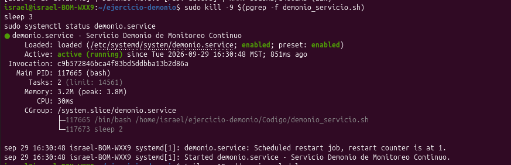
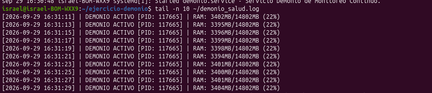

cat << 'EOF' > ~/ejercicio-demonio/README.md
# Servicio Continuo y Demonio con Systemd en Ubuntu

## 🎯 Objetivos
* Diseñar e implementar un demonio en segundo plano desacoplado de la terminal que opere en un ciclo continuo ininterrumpido.
* Registrar periódicamente en una bitácora local la fecha con segundos, el PID actual asignado por el kernel y el consumo de memoria RAM.
* Implementar tolerancia a fallos mediante el gestor de servicios `systemd`, garantizando que si el proceso es eliminado de forma forzada (`kill -9`), el sistema operativo lo reinicie automáticamente en menos de 5 segundos con un nuevo PID.

---

## 📁 Jerarquía de Carpetas

* 📁 **[Codigo/](Codigo/)**: Script de ejecución continua en Bash y archivo de unidad de servicio `.service` para `systemd`.
* 📁 **[Terminal/](Terminal/)**: Capturas nítidas de la supervisión del servicio, bitácora en tiempo real y prueba forzada de terminación.
* 📁 **[Reporte/](Reporte/)**: Reporte formal en formato PDF con justificación teórica del comportamiento de procesos y señales en Linux.

---

## 🛠️ Explicación de Comandos y Herramientas

| Comando / Parámetro | Función Técnica en la Práctica |
| :--- | :--- |
| `while true; do ... sleep 2; done` | Bucle de ejecución infinita que mantiene al proceso activo y consultando métricas periódicamente. |
| `$$` | Variable especial de shell que expande dinámicamente el PID (Process ID) asignado al proceso en ejecución. |
| `date '+%Y-%m-%d %H:%M:%S'` | Obtiene la marca temporal exacta incluyendo segundos para auditar la frecuencia continua de registro. |
| `free -m` | Consulta las estructuras de memoria en `/proc/meminfo` para calcular el porcentaje de RAM física ocupada. |
| `systemctl status demonio.service` | Inspecciona el árbol de control (cgroup), estado de ejecución y el Main PID gestionado por systemd. |
| `kill -9 <PID>` / `SIGKILL` | Señal ineludible enviada al kernel para finalizar de forma inmediata e incondicional el proceso objetivo. |
| `Restart=always` / `RestartSec=2` | Directivas de `systemd` que supervisan la salida del proceso y disparan su relanzamiento en 2 segundos. |
| `tail -n 10` | Inspecciona los registros finales de la bitácora para validar la persistencia antes y después del reinicio. |

---

## 📸 Evidencias de la Terminal

|  |  |
| :---: | :---: |
| **1. Demonio activo en Systemd (`running`)** | **2. Bitácora continua con segundos y PID** |
|  |  |
| **3. Muerte forzada con `kill -9` y nuevo PID** | **4. Registro del cambio de PID en bitácora** |

---

## 📄 Reporte Formal

* 📎 [Descargar Reporte PDF](Reporte/Reporte_Demonio_Systemd.pdf)

---

## 💻 Código y Scripts

* 📜 **Script del Demonio:** [demonio_servicio.sh](Codigo/demonio_servicio.sh)
* ⚙️ **Unidad de Systemd:** [demonio.service](Codigo/demonio.service)

```bash
# Comando de terminación forzada utilizado en la prueba:
sudo kill -9 $(pgrep -f demonio_servicio.sh)
